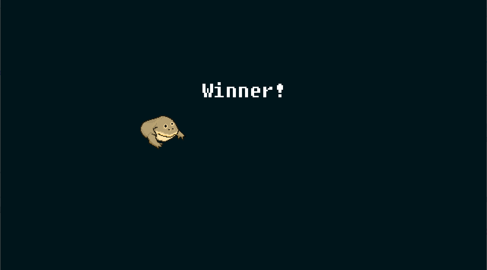

```txt
Be the wednesday. Unlike challenge 1, you probably won't be able to beat this game the old fashioned way. Read the README.txt file, it is very important.
```

```txt
$ file wednesday/mydude.exe
wednesday/mydude.exe: PE32 executable (console) Intel 80386, for MS Windows
```
> Note: this is not the only file, but are the most important (see below)

## Introduction

The content of README.md (as the message says):
```txt
██╗    ██╗███████╗██████╗ ███╗   ██╗███████╗███████╗██████╗  █████╗ ██╗   ██╗
██║    ██║██╔════╝██╔══██╗████╗  ██║██╔════╝██╔════╝██╔══██╗██╔══██╗╚██╗ ██╔╝
██║ █╗ ██║█████╗  ██║  ██║██╔██╗ ██║█████╗  ███████╗██║  ██║███████║ ╚████╔╝ 
██║███╗██║██╔══╝  ██║  ██║██║╚██╗██║██╔══╝  ╚════██║██║  ██║██╔══██║  ╚██╔╝  
╚███╔███╔╝███████╗██████╔╝██║ ╚████║███████╗███████║██████╔╝██║  ██║   ██║   
 ╚══╝╚══╝ ╚══════╝╚═════╝ ╚═╝  ╚═══╝╚══════╝╚══════╝╚═════╝ ╚═╝  ╚═╝   ╚═╝   

                        --- BE THE WEDNESDAY ---

                                   S
                                   M
                                   T
                                  DUDE
                                   T
                                   F
                                   S

                --- Enable accelerated graphics in VM ---
                  --- Attach sound card device to VM ---
                    --- Only reverse mydude.exe ---
                       --- Enjoy it my dudes ---
```

So we only need to reverse `mydude.exe`, the rest of the files seems `dll` files for
`SDL` library, graphics and music.

This looks like [nim] binary, as the binary contained strings like:
```python
"fatal.nim",
"io.nim",
```

[nim] is a compiled language, also looking at the disassembly, the debug information are
still present in this binary, so this is good for us.

## Information collecting

### Basic static analysis
Looking at the names of the functions, we see `_NimMain`, which looks like the main
function for [nim] compiled binaries.

Inside `_NimMain` we see `_PreMain` and `_NimMainInner`.

In `_PreMain`, I think it initializes objects, the interesting names are `nimgame2` and
`sdl2`. which suggest that the library called `nimgame2` is used here. There is also
`unknown`, which I think are the objects in from this binary and not external libraries.

The names associated with `unknown`:
```txt                                
- obstacle
- player
- title
- ground
- main
- win
```

Looking into `_NimMainInner` next, we see the same objects names being initialized,
for example:
```C
@newGame__BQ3qe3V9cZtIsYSbLSlQl9aA@0()
@newMainScene__OdaO74LCCWT0gxWpsgg8BA@0()
@newWinScene__Jki0WwBdPX9b9bwfWfPbtoFg@4()
```
> From now on functions names will not have the garbage/hash thing at the end.

and many `nimgame2` functions are being used.

### Running the game

Next, lets run the game to understand what is happening.

Title scene:

Main scene:


In this game we have to jump (up) or duck (down) in order to avoid the obstacles.

Even though all of them seem that they are open from the bottom but some, you can jump on them and some you cannot (trying to jump will restart the game even though visually you did not collide with the block, same way for ducking).

### Trying to win (did not work)

In the code, we can see `@newMainScene` and `@newWinScene`, then:
```C
  // _game_ and _titleScene_ are global variables containing pointer to the object      
  @sceneeq(_game_,_titleScene_);
```

This function is from `nimgame2` which sets the scene of the game object.

I tried to set `_winScene_` directly using the debugger by changing the argument of
`sceneeq`, but I didn't get the flag :D



The `_winScene_` is being set in `@update__giAKdkRYJ1A0Qn9asB8s9ajA@12`:
```C
  score = *(int **)(*(int *)((int)this + 0x28) + 0xfc);
  if ((score != (int *)0x0) && (*score == 0x128)) {
    @sceneeq(_game_,_winScene_);
  }
```

I think this is checking the score to be equal to `0x128` and then sets the scene to
`_winScene_`, so we can assume in order to win this game we have to reach score of `296`.

I'm guessing that `(this + 0x28) + 0xfc)`, is the score attribute in `player` object,
but looking at the above `@update` method we see a global variable `_score_`, which is being incremented in `@onCollide`.

Using this info, I'm thinking of disabling the game from catching collisions and just passing through all blocks to win without touching the controls!.

### Approach on how to win

My approach is not to try to decode the flag and instead, patching the game to make it win by itself.

## Solution

From above, the global `_score_` is being incremented in `@onCollide` if some checks are passed first.

One of the checks that I managed to change and it did not break
```C
          if ((int)*(char *)(param_2 + 0x3e) != (uint)*(byte *)(param_1 + 0x3e)) {
            // ... trimmed
            return;
          }
          // ... trimmed
          _score__h34o6jaI3AO6iOQqLKaqhw = _score__h34o6jaI3AO6iOQqLKaqhw + 1;
```

In the debuuger, we can change:
```asm
00432356 CMP  EDX,EAX
00432358 JZ   LAB_00432261
```
to
```asm
00432356 CMP  EDX,EAX
00432358 JMP  LAB_00432261
```
Which would make this branch always jump to `LAB_00432261`.

When applying this change, the game can be finished if we keep pressing `DOWN` only, so it will ignore that the block require jumping.

Using this only we can win but we need to keep pressing `DOWN` for a long time, but now that we know how to edit things, lets try to patch the keyboard event handler.

After some looking, we find it in `@event__KcWmTv6MM2mga1O5Xvx0Rw@8` at the end:
```C
  if (iVar2 == 0x300) {
    if (param_2[5] == 0x40000051) {
      // ... trimmed
      @duck__sGe9c9bxuFSjBvFwh9bgm9cTTg_3@4(ppVar4);
    }
    else {
      // ... trimmed
      @jump__sGe9c9bxuFSjBvFwh9bgm9cTTg_2@4(ppVar4);
    }
  }
```

So lets start patching, the first one is the 0x300 compare block, since we don't need to jump, we can replace the below `JNZ` instruction with `NOP`s instructions.
```asm
004325d8 CMP  EAX,0x300
004325dd JNZ  LAB_00432610
```
Next, for the `DOWN` pressing check, we need to force this jump, so we can replace the below `JZ` instruction with `JMP`, its good that the size of the instruction is the same (sometimes it might be less in size).
```asm
004325e6 CMP  EAX,0x40000051
004325eb JZ   LAB_00432640
```

Patching the `3` places mentioned above, would result in the frog always ducking and finishing the game, now we just wait...

And that's the flag:


Flag:
```txt
1t_i5_wEdn3sd4y_mY_Dud3s@flare-on.com
```

> The solution is a bit strange I think, I don't know where the flag is being
> decoded/displayed or anything in that matter, the good thing is that the score
> required to win is not much like the first challenge.

> Also setting the global variable did not solve the challenge, so ya.
> I didn't try to change the what I believe the score property in `player` object.

> Also helped to look at `nimgame2` demo games, to know what are the names of the
> functions and extra things about `nim-lang` in general.


[nim]: https://nim-lang.org/
